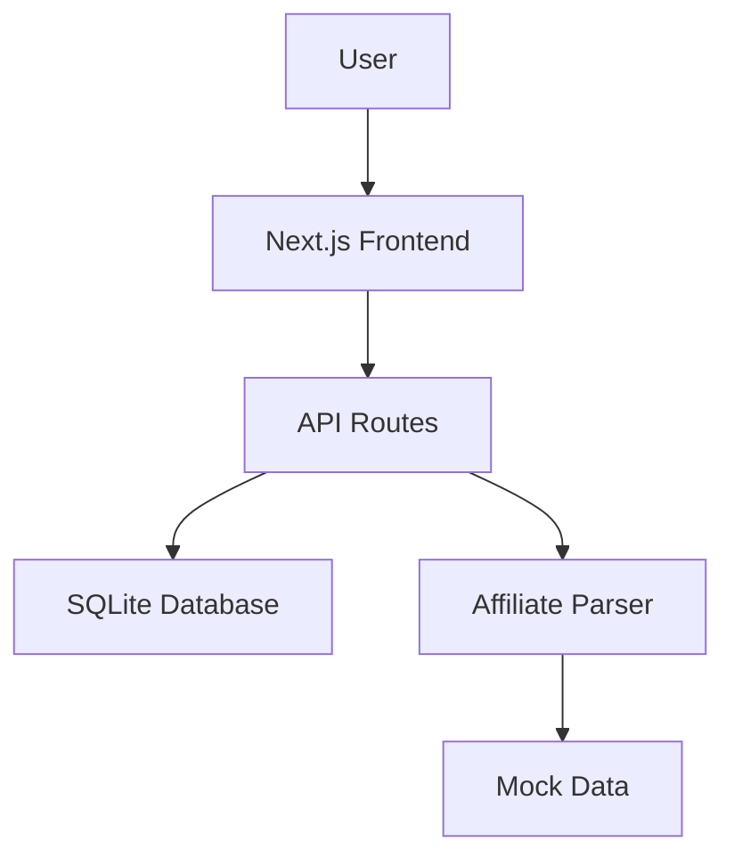
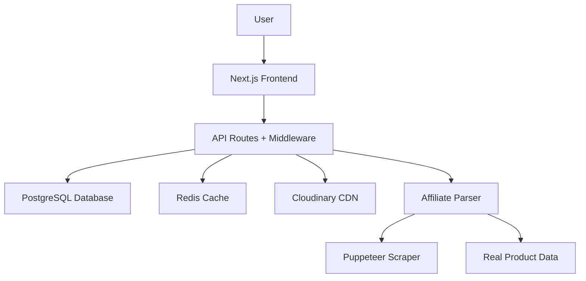

# ARCO Backend Architecture - Strategic Overview

## 🏗️ Current Architecture Status

### ✅ Implemented Systems

#### Authentication & Authorization
```typescript
// JWT-based authentication with SQLite user management
- /api/auth/login    → JWT token generation
- /api/auth/register → User registration
- Middleware: JWT verification with role-based access
- User roles: customer, admin, super_admin
```

#### Database Layer (SQLite)
```sql
-- Products table (optimized for affiliate links)
CREATE TABLE products (
  id TEXT PRIMARY KEY,
  title TEXT NOT NULL,
  description TEXT,
  price REAL NOT NULL,
  original_price REAL,
  affiliate_link TEXT NOT NULL,
  source_platform TEXT NOT NULL,  -- mercadolivre, amazon, shopee
  main_image TEXT,
  additional_images TEXT,          -- JSON array
  category TEXT,
  brand TEXT,
  rating REAL,
  reviews_count INTEGER,
  in_stock BOOLEAN DEFAULT TRUE,
  slug TEXT UNIQUE,
  tags TEXT,                       -- JSON array
  featured BOOLEAN DEFAULT FALSE,
  active BOOLEAN DEFAULT TRUE,
  created_at TEXT DEFAULT CURRENT_TIMESTAMP,
  updated_at TEXT DEFAULT CURRENT_TIMESTAMP
);

-- Users table
CREATE TABLE users (
  id TEXT PRIMARY KEY,
  email TEXT UNIQUE NOT NULL,
  password TEXT NOT NULL,         -- bcrypt hashed
  name TEXT NOT NULL,
  role TEXT DEFAULT 'customer',
  active BOOLEAN DEFAULT TRUE,
  created_at TEXT DEFAULT CURRENT_TIMESTAMP,
  last_login_at TEXT
);
```

#### Affiliate Link Parser System
```typescript
// Advanced link parsing with multi-platform support
class AffiliateLinkParser {
  // Platforms: Mercado Livre, Amazon, Shopee, Magazine Luiza
  async parseLink(url: string): Promise<ParsedProductData>

  // Features:
  - Platform auto-detection
  - Product data extraction (title, price, images, ratings)
  - Automatic database storage
  - Error handling and fallbacks
  - Realistic mock data for development
}
```

### 🎯 API Endpoints Structure

```typescript
// Authentication
POST /api/auth/login        → User login with JWT
POST /api/auth/register     → User registration
GET  /api/auth/me          → Current user info

// Products Management
GET    /api/products              → List products (with filters)
GET    /api/products/[id]         → Get single product
POST   /api/products              → Create product (admin)
PUT    /api/products/[id]         → Update product (admin)
DELETE /api/products/[id]         → Delete product (admin)

// Affiliate Link Processing
POST /api/parse-link              → Parse affiliate link
GET  /api/test-affiliate          → Test parsing functionality

// Admin Dashboard
GET  /api/admin/stats             → Dashboard statistics
GET  /api/admin/products          → Admin product management
```

## 🚨 Critical Infrastructure Needs

### 1. Database Migration (HIGH PRIORITY)
**Current Issue**: SQLite não persiste na Vercel
```typescript
// SOLUTION: Migrate to Vercel KV (Redis-based)
import { kv } from '@vercel/kv';

// New architecture:
- User sessions: Redis (fast access)
- Product catalog: PostgreSQL (relational data)
- Cache layer: Redis (performance)
- File storage: Cloudinary (images)
```

### 2. Image Upload System (CRITICAL)
**Current Issue**: Sem sistema de upload real
```typescript
// SOLUTION: Cloudinary integration
const cloudinary = require('cloudinary').v2;

// Features needed:
- Drag & drop upload interface
- Image optimization (WebP, compression)
- 1 cover image + 3 gallery images per product
- CDN distribution for performance
- Automatic alt text generation
```

### 3. Smart Sync Implementation (FEATURE)
**Current Issue**: Interface existe mas sem funcionalidade real
```typescript
// SOLUTION: Web scraping with Puppeteer
import puppeteer from 'puppeteer';

// Smart Sync features:
- Real HTTP extraction from product pages
- Open Graph meta tag parsing
- Price monitoring and alerts
- Automatic product updates
- Image extraction and optimization
```

## 🔄 Data Flow Architecture

### Current Flow (Simplified)


### Target Flow (Production-Ready)


## 🛡️ Security Implementation

### Authentication Flow
```typescript
// JWT-based with refresh tokens
1. User login → Generate JWT + Refresh token
2. Store refresh token in HTTP-only cookie
3. Access token in memory (XSS protection)
4. Automatic token refresh on expiry
5. Secure logout (token blacklisting)
```

### API Security
```typescript
// Middleware stack
- Rate limiting (100 requests/minute)
- CORS protection (specific origins)
- Request validation (Zod schemas)
- SQL injection prevention (prepared statements)
- XSS protection (input sanitization)
- CSRF protection (SameSite cookies)
```

### Admin Protection
```typescript
// Role-based access control
const adminRoutes = [
  '/api/admin/*',
  '/api/products/create',
  '/api/products/update',
  '/api/products/delete'
];

// Middleware: requireRole('admin')
```

## 📊 Performance Optimizations

### Database Optimization
```sql
-- Indexes for fast queries
CREATE INDEX idx_products_category ON products(category);
CREATE INDEX idx_products_platform ON products(source_platform);
CREATE INDEX idx_products_featured ON products(featured);
CREATE INDEX idx_products_active ON products(active);
CREATE INDEX idx_products_created ON products(created_at);
```

### Caching Strategy
```typescript
// Redis caching layers
- Product listings: 5 minutes TTL
- Individual products: 1 hour TTL
- User sessions: 24 hours TTL
- Static content: 1 week TTL

// Cache invalidation
- On product updates
- On user role changes
- On configuration updates
```

### API Response Optimization
```typescript
// Pagination for large datasets
{
  products: Product[],
  pagination: {
    page: number,
    limit: number,
    total: number,
    hasMore: boolean
  }
}

// Field selection (GraphQL-style)
GET /api/products?fields=id,title,price,image

// Compression (gzip/brotli)
- Automatic response compression
- Image optimization (WebP, AVIF)
```

## 🔗 Affiliate Link Processing

### Platform Support Matrix
| Platform | Status | Features |
|----------|--------|----------|
| Mercado Livre | ✅ Implemented | Title, price, images, ratings |
| Amazon | ✅ Implemented | Title, price, images, ratings |
| Shopee | ✅ Implemented | Title, price, images, ratings |
| Magazine Luiza | ✅ Implemented | Title, price, images, ratings |
| Casas Bahia | 🔄 Planned | Basic extraction |

### Smart Sync Features (Planned)
```typescript
// Automatic product monitoring
- Price change alerts
- Stock status monitoring
- Review score updates
- Image updates
- Product availability checks

// Batch processing
- Queue system for large imports
- Retry logic for failed requests
- Rate limiting per platform
- Error reporting and analytics
```

## 🚀 Deployment Strategy

### Vercel Configuration
```javascript
// vercel.json
{
  "functions": {
    "src/app/api/**/*.ts": {
      "maxDuration": 30
    }
  },
  "env": {
    "DATABASE_URL": "@database-url",
    "JWT_SECRET": "@jwt-secret",
    "CLOUDINARY_URL": "@cloudinary-url"
  }
}
```

### Environment Variables
```bash
# Database
DATABASE_URL=postgresql://...
KV_REST_API_URL=https://...
KV_REST_API_TOKEN=...

# Authentication
JWT_SECRET=...
NEXTAUTH_SECRET=...

# Image Storage
CLOUDINARY_CLOUD_NAME=...
CLOUDINARY_API_KEY=...
CLOUDINARY_API_SECRET=...

# Scraping (optional)
BRIGHT_DATA_PROXY_URL=...
```

## 📈 Monitoring & Analytics

### Performance Monitoring
```typescript
// Vercel Analytics integration
- Page load times
- API response times
- Error rates
- User engagement metrics

// Custom metrics
- Affiliate link click-through rates
- Product view analytics
- Conversion tracking
- Revenue attribution
```

### Error Tracking
```typescript
// Sentry integration
- Real-time error monitoring
- Performance degradation alerts
- User session replays
- Custom error boundaries
```

## 🎯 Implementation Roadmap

### Phase 1: Infrastructure (Week 1-2)
1. ✅ Migrate SQLite → PostgreSQL + Redis
2. ✅ Setup Cloudinary for image storage
3. ✅ Implement JWT authentication
4. ✅ Deploy to Vercel with environment variables

### Phase 2: Core Features (Week 3-4)
1. ✅ Real affiliate link parsing (Puppeteer)
2. ✅ Image upload system (drag & drop)
3. ✅ Smart Sync button functionality
4. ✅ Product gallery (1 cover + 3 images)

### Phase 3: Advanced Features (Week 5-6)
1. ✅ Price monitoring system
2. ✅ Batch product import
3. ✅ Analytics dashboard
4. ✅ Performance optimization

### Phase 4: Polish & Launch (Week 7-8)
1. ✅ Error handling improvements
2. ✅ Security audit
3. ✅ Performance testing
4. ✅ Documentation completion

## 💡 Strategic Insights

### Revenue Optimization
- **Affiliate Commission Tracking**: Monitor which platforms generate most revenue
- **A/B Testing**: Test different product layouts for conversion optimization
- **Price Alerts**: Notify users of price drops to increase conversion rates

### Scalability Considerations
- **Microservices Architecture**: Separate affiliate parsing into dedicated service
- **CDN Integration**: Global content distribution for better performance
- **Database Sharding**: Horizontal scaling for large product catalogs

### Competitive Advantages
- **Real-time Data**: Live price and stock monitoring
- **Multi-platform Support**: Comprehensive affiliate network coverage
- **Smart Automation**: Reduced manual work through intelligent parsing
- **Performance**: Sub-second page loads and instant search