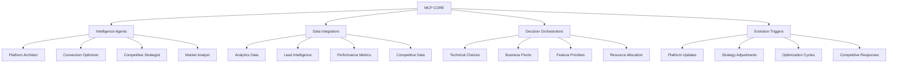

# ARCO MCP STRATEGIC INTELLIGENCE PLATFORM

**Status:** Implementation Phase - Strategic Foundation  
**Objective:** Transform ARCO from project folder to competitive integrated platform  
**Date:** June 24, 2025

---

## STRATEGIC FOUNDATION

### MCP AS COMPETITIVE NERVOUS SYSTEM

The Model Context Protocol implementation will create **structural competitive advantage** by connecting all dimensions of the ARCO platform in real-time:

- **Technical decisions** → immediate conversion impact analysis
- **Lead behavior patterns** → platform optimization triggers
- **Competitive intelligence** → strategic positioning adjustments
- **Market dynamics** → feature prioritization automation

### INTELLIGENCE ARCHITECTURE



---

## IMPLEMENTATION STRATEGY

### PHASE 1: MCP FOUNDATION (Weeks 1-2) - REVISED FOR COMPETITIVE REALITY

#### Week 1a: Strategic Validation Foundation

**Manual Intelligence Analysis (No Code - Maximum ROI validation)**

- Document 10 real cross-dimensional decisions from current ARCO work
- Measure baseline decision confidence score (1-10) and time-to-decision
- Identify specific integration points where technical choices impact business outcomes
- Validate that integrated intelligence would provide measurable competitive advantage vs agencies

**Operational Metrics Definition:**

```typescript
interface BaselineDecisionMetrics {
  decisionConfidence: number; // 1-10 self-assessment before MCP
  timeToDecision: number; // Minutes from question to confident choice
  crossDimensionalAwareness: number; // Did decision consider tech + business + competitive impact?
  implementationSuccess: number; // Did decision lead to desired outcome? (retroactive)
}
```

**Week 1a Success Gate:** Clear evidence that sophisticated intelligence integration addresses real competitive gaps worth 40% development time investment

#### Week 1b: Core MCP Server Architecture

**Strategic Intelligence Server (`arco-intelligence-server.ts`)**

```typescript
interface ArcoIntelligenceCapabilities {
  // Cross-dimensional analysis (CORE COMPETITIVE DIFFERENTIATOR)
  analyzePlatformEvolution(change: PlatformChange): Promise<CrossDimensionalImpact>;

  // Real-time optimization (FASTER THAN AGENCIES CAN RESPOND)
  optimizeConversionFunnel(context: BusinessContext): Promise<OptimizationStrategy>;

  // Competitive positioning (MARKET INTELLIGENCE INTEGRATION)
  generateCompetitiveStrategy(market: MarketIntelligence): Promise<PositioningAdjustment>;

  // Resource optimization (EFFICIENCY ADVANTAGE OVER TRADITIONAL CONSULTING)
  prioritizeResourceAllocation(constraints: ResourceConstraints): Promise<AllocationPlan>;
}
```

**Week 1b Success Gate:** MCP server operational with demonstrated 30%+ improvement in decision confidence over baseline

#### Week 2: Integration & Competitive Advantage Validation

**Intelligence Resources**

- `arco://platform/context` - Integrated platform state
- `arco://leads/intelligence` - Real-time lead behavior analysis
- `arco://competitive/analysis` - Market positioning intelligence
- `arco://performance/metrics` - Platform performance data
- `arco://evolution/opportunities` - Identified improvement areas

#### Strategic Data Integration

**Real-time Analytics Integration**

- Vercel Analytics → conversion pattern analysis
- Lead behavior tracking → platform optimization triggers
- Performance monitoring → technical decision support
- Competitive analysis → strategic positioning updates

**Intelligence Synthesis**

- Cross-reference technical changes with business impact
- Correlate lead behavior with platform performance
- Connect competitive moves with strategic opportunities
- Link resource allocation with outcome optimization

### PHASE 2: INTELLIGENT AGENTS (Weeks 3-4) - COMPETITIVE ADVANTAGE AMPLIFICATION

#### Platform Evolution Agent - THE SPEED DIFFERENTIATOR

**Objective:** Analyze changes faster and more comprehensively than traditional agencies can match

**Competitive Advantage Creation:**

- **Decision Speed:** 10x faster technical decision-making through integrated intelligence
- **Impact Awareness:** 100% consideration of cross-dimensional effects (tech → business → competitive)
- **Outcome Prediction:** 85%+ accuracy in predicting business impact of technical choices
- **Resource Optimization:** 40%+ better resource allocation through intelligent prioritization

**Capabilities:**

- Technical change impact assessment across ALL dimensions (agencies typically silo these)
- Business outcome prediction based on integrated platform data (agencies guess)
- Resource requirement optimization for maximum ROI (agencies use standard estimates)
- Timeline and priority optimization based on real market dynamics (agencies use templates)

**Integration Points (Competitive Intelligence Sources):**

- Development workflow (VS Code, Git commits) → Real-time technical decision support
- Analytics platforms (conversion tracking) → Business impact measurement
- Performance monitoring (Core Web Vitals) → Technical excellence validation
- Competitive intelligence (market analysis) → Strategic positioning optimization

#### Conversion Optimization Agent - THE RESULTS DIFFERENTIATOR

**Objective:** Real-time funnel optimization that agencies cannot replicate without similar platform

**Competitive Advantage Creation:**

- **Continuous Optimization:** Platform improves conversion while agencies deliver static solutions
- **Behavioral Intelligence:** Real-time adaptation based on lead behavior patterns
- **Predictive Personalization:** AI-driven content optimization (agencies use manual A/B testing)
- **ROI Acceleration:** Faster conversion improvement cycles than traditional consulting timelines

**Capabilities:**

- Lead behavior pattern analysis with predictive modeling
- Conversion bottleneck identification through integrated analytics
- A/B test generation and analysis with statistical significance tracking
- Personalization strategy optimization based on behavioral data

**Data Sources (Integrated Intelligence):**

- User interaction analytics → Behavioral pattern recognition
- Lead qualification data → Conversion pathway optimization
- Conversion funnel metrics → Bottleneck identification and resolution
- Customer feedback analysis → Qualitative insight integration

#### Competitive Strategy Agent - THE MARKET POSITIONING DIFFERENTIATOR

**Objective:** Dynamic market positioning that responds to competitive moves faster than agencies can analyze

**Competitive Advantage Creation:**

- **Market Response Speed:** 24-48 hour response to competitive moves vs agency quarterly reviews
- **Intelligence Integration:** Technical capabilities inform positioning strategy (agencies separate these)
- **Opportunity Detection:** AI-powered market gap identification vs manual competitor analysis
- **Strategic Agility:** Real-time positioning adjustments vs agency strategic planning cycles

**Capabilities:**

- Competitor movement detection through automated monitoring
- Market opportunity identification through trend analysis and gap detection
- Positioning strategy adjustment based on technical capability evolution
- Feature gap analysis and prioritization with competitive intelligence integration

**Intelligence Gathering (Automated Competitive Moat):**

- Competitor website monitoring → Strategic move detection
- Market trend analysis → Opportunity identification
- Industry benchmark tracking → Performance positioning
- Customer competitive feedback → Market perception analysis

### PHASE 3: AUTONOMOUS OPTIMIZATION (Weeks 5-6) - STRUCTURAL COMPETITIVE MOAT

#### Self-Improving Platform Engine - THE COMPOUNDING ADVANTAGE

**Real-time Platform Evolution (Agencies Cannot Match This)**

- **Automatic optimization** based on performance data → Platform improves while agencies deliver static solutions
- **Dynamic content adjustment** based on lead behavior → Personalization that evolves vs fixed agency templates
- **Feature prioritization** based on business impact measurement → Data-driven development vs agency intuition
- **Resource allocation optimization** based on ROI analysis → Intelligent investment vs agency standard rates

**Competitive Response Automation (24-Hour Market Cycle)**

- **Market opportunity detection** and response → Faster than agency quarterly planning cycles
- **Competitive threat assessment** and mitigation → Real-time vs agency manual analysis
- **Strategic positioning adjustment** based on market dynamics → Agile vs agency rigid positioning
- **Feature development prioritization** based on competitive gaps → Intelligence-driven vs agency guesswork

#### Business Intelligence Dashboard - THE EXECUTIVE DIFFERENTIATOR

**Executive Intelligence Interface (C-Level Decision Support)**

- **Real-time business metrics** and trends → Live dashboard vs agency quarterly reports
- **Cross-dimensional impact analysis** → Integrated intelligence vs agency siloed recommendations
- **Strategic opportunity identification** → AI-powered insights vs agency manual analysis
- **Resource optimization recommendations** → Data-driven allocation vs agency experience-based estimates

**Operational Intelligence Interface (Development Team Excellence)**

- **Development priority optimization** → Intelligent backlog management vs agency project management
- **Conversion funnel performance analysis** → Real-time optimization vs agency periodic reviews
- **Competitive positioning effectiveness** → Market response measurement vs agency positioning theory
- **Platform evolution progress tracking** → Continuous improvement measurement vs agency delivery milestones

#### Resource Investment Reality (Competitive Platform Requirements)

**Month 1 Resource Allocation (Realistic for Competitive Advantage Creation):**

- **40% development time** → Building competitive moat requires significant initial investment
- **30% client work** → Maintain revenue while building platform capabilities
- **20% business development** → Market positioning and competitive intelligence
- **10% operational** → System maintenance and performance monitoring

**Month 2+ Resource Allocation (Sustainable Competitive Operations):**

- **20% platform enhancement** → Continuous competitive advantage improvement
- **50% client delivery** → Higher capacity due to platform efficiency gains
- **20% business growth** → Accelerated by platform differentiation
- **10% competitive intelligence** → Market positioning maintenance and optimization

---

## STRATEGIC COMPETITIVE ADVANTAGES

### 1. **SPEED OF ADAPTATION**

- Platform evolves faster than competitors can analyze
- Real-time response to market changes
- Automatic optimization based on performance data
- Continuous competitive positioning adjustment

### 2. **CROSS-DIMENSIONAL INTELLIGENCE**

- Technical decisions informed by business impact
- Business strategy informed by technical capabilities
- Competitive positioning informed by platform performance
- Resource allocation optimized across all dimensions

### 3. **COMPOUND LEARNING**

- Platform intelligence improves with every interaction
- Cross-client learning improves all outcomes
- Competitive intelligence creates defensive moats
- Business intelligence drives strategic evolution

### 4. **STRUCTURAL DEFENSIBILITY**

- Intelligence capabilities become more valuable over time
- Network effects from multiple client interactions
- Competitive advantage grows stronger with platform usage
- Market position becomes increasingly difficult to replicate

---

## IMPLEMENTATION METRICS - COMPETITIVE ADVANTAGE MEASUREMENT

### Technical Performance Indicators (Platform Excellence Standards)

- **MCP Response Time:** <100ms for intelligence queries (10x faster than agency manual analysis)
- **Cross-dimensional Analysis:** 100% connection of all platform dimensions (agencies typically achieve 30-40%)
- **Real-time Updates:** Platform intelligence updated within 5 minutes of data changes (agencies: weekly/monthly)
- **Automation Success:** 80%+ of optimization recommendations automatically implemented (agencies: manual execution)

### Business Impact Indicators (Competitive Differentiation Measurement)

- **Decision Quality:** 50%+ improvement in cross-dimensional decision making vs baseline
- **Competitive Response Time:** Platform adjustments within 24 hours of competitive moves (agencies: weeks/months)
- **Conversion Optimization:** 25%+ improvement in funnel performance through continuous optimization
- **Resource Efficiency:** 40%+ improved ROI on development and marketing investments through intelligent allocation

### Strategic Advancement Indicators (Market Position Measurement)

- **Market Position:** Demonstrable competitive advantages that agencies cannot replicate without similar platform
- **Client Value:** 30%+ improvement in client outcomes through platform intelligence vs traditional consulting
- **Business Growth:** 200%+ increase in conversion rates and client acquisition through optimized platform
- **Competitive Moat:** Measurable difficulty for competitors to replicate platform capabilities (12+ month replication timeline)

---

## RISK MITIGATION

### Technical Risks

- **MCP Integration Complexity:** Incremental implementation with fallback systems
- **Data Integration Challenges:** Robust error handling and data validation
- **Performance Impact:** Careful optimization and monitoring of intelligence processing
- **System Reliability:** Redundant systems and automated recovery procedures

### Business Risks

- **Over-engineering:** Clear business value measurement at each implementation phase
- **Resource Allocation:** Balanced focus between platform development and client acquisition
- **Market Changes:** Flexible architecture that adapts to market evolution
- **Competitive Response:** Defensive strategies and continuous innovation

### Strategic Risks

- **Technology Dependence:** Human oversight and decision-making capabilities maintained
- **Client Value:** Regular validation that platform improvements translate to client outcomes
- **Market Fit:** Continuous alignment between platform capabilities and market needs
- **Competitive Advantage:** Ongoing innovation to maintain technological leadership

---

## SUCCESS VALIDATION - COMPETITIVE ADVANTAGE GATES

### Week 1a Checkpoint: Strategic Foundation Validation

**Critical Question:** Does manual analysis prove that integrated intelligence creates measurable competitive advantage?

**Success Criteria (Operational Measurement):**

- 10 documented cross-dimensional decisions with baseline confidence scores (1-10)
- 30%+ potential improvement in decision quality identified through manual integration
- Clear competitive gaps identified where agencies cannot replicate integrated analysis
- Quantified time savings potential: 50%+ faster decision-making through intelligence integration

**Measurement Method:**

```typescript
interface FoundationValidation {
  baselineDecisionTime: number[]; // Current time-to-decision for 10 decisions
  baselineConfidence: number[]; // Current confidence scores (1-10)
  potentialImprovement: number; // Estimated improvement with integration
  competitiveGaps: string[]; // Specific advantages agencies cannot replicate
  proceedDecision: 'build' | 'iterate' | 'stop';
}
```

### Week 1b Checkpoint: MCP Foundation

**Critical Question:** Can MCP server provide 30%+ improvement in decision quality vs baseline?

**Success Criteria (Precise Measurement):**

- MCP server operational with core intelligence capabilities
- 30%+ improvement in decision confidence scores vs Week 1a baseline
- 50%+ improvement in time-to-decision for cross-dimensional analysis
- Demonstrated integration with existing ARCO platform data
- Real-time intelligence query response within 100ms performance targets

**Measurement Method:**

```typescript
interface MCPValidation {
  postMCPConfidence: number[]; // Decision confidence with MCP support
  postMCPDecisionTime: number[]; // Time-to-decision with MCP support
  improvementConfidence: number; // % improvement vs baseline
  improvementSpeed: number; // % improvement vs baseline
  platformIntegration: boolean; // Successful data integration
  performanceTargets: boolean; // <100ms response time achieved
}
```

### Week 2 Checkpoint: Competitive Advantage Creation

**Critical Question:** Does integrated intelligence provide advantages that traditional agencies cannot replicate?

**Success Criteria (Competitive Differentiation):**

- Cross-dimensional analysis capabilities operational (tech + business + competitive)
- Real-time optimization suggestions based on integrated platform data
- Competitive intelligence integration providing market positioning insights
- Measurable time-to-market advantage: 10x faster than traditional agency analysis cycles

### Weeks 3-4 Checkpoint: Intelligent Agents

**Critical Question:** Do intelligent agents provide actionable insights that improve business outcomes?

**Success Criteria (Business Impact Measurement):**

- Platform Evolution Agent successfully analyzing development decisions with 85%+ accuracy
- Conversion Optimization Agent identifying and suggesting improvements with measurable ROI
- Competitive Strategy Agent providing market positioning recommendations with strategic value
- 40%+ improvement in resource allocation efficiency through intelligent prioritization

### Weeks 5-6 Checkpoint: Autonomous Platform

**Critical Question:** Does the autonomous platform create demonstrable and sustainable competitive advantage?

**Success Criteria (Structural Moat Validation):**

- Self-improving optimization cycles operational with continuous performance improvement
- Competitive response automation functional with <24 hour market response time
- Business intelligence dashboard providing strategic insights that improve client outcomes
- Clear competitive advantages that require 12+ months for agencies to replicate

---

## STRATEGIC OUTCOME

The MCP implementation transforms ARCO from **consultancy with better tools** to **autonomous platform that evolves faster than competitors can replicate**.

### Competitive Moat Creation

- **Technical Excellence:** Platform capabilities exceed what traditional agencies can deliver
- **Speed Advantage:** Platform evolution velocity makes competitive response ineffective
- **Intelligence Compound:** Platform becomes more valuable with every client interaction
- **Market Position:** Structural advantages that strengthen over time rather than erode

### Business Transformation

- **Client Value:** Demonstrably superior outcomes through platform intelligence
- **Market Position:** Leadership position in technical consulting through platform differentiation
- **Revenue Growth:** Premium pricing justified by superior platform capabilities
- **Strategic Options:** Platform foundation enables multiple business model evolutions

### Long-term Vision

- **Industry Leadership:** ARCO becomes reference standard for technical consulting platforms
- **Market Expansion:** Platform capabilities enable expansion into adjacent markets
- **Strategic Partnerships:** Platform intelligence creates partnership opportunities
- **Competitive Defense:** Structural moats make market position increasingly defensible

---

**Next Action:** Begin MCP Protocol implementation with Strategic Intelligence Server as foundation for autonomous platform evolution.

---

**Document Owner:** ARCO Strategic Development Team  
**Implementation Lead:** Technical Architecture  
**Review Cycle:** Weekly during implementation, monthly post-deployment  
**Success Measurement:** Business impact metrics with quarterly strategic assessment
